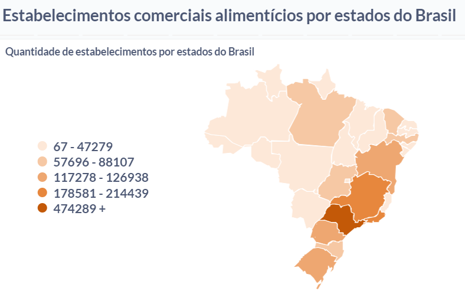

## 1. Justificativa da Escolha:
A escolha do Metabase é fundamentada em sua abordagem de código aberto, oferecendo vantagens financeiras e adaptabilidade às necessidades específicas do projeto. Isso é particularmente relevante em projetos com restrições orçamentárias ou requisitos personalizados. Fontes como a documentação oficial do Metabase e discussões na comunidade open source destacam a acessibilidade financeira e a liberdade de personalização oferecidas por essa ferramenta.

## 2. Configuração da Ferramenta:
A facilidade de configuração do Metabase destaca-se na implementação do projeto. A documentação detalhada e a comunidade ativa simplificam o processo, permitindo uma integração eficiente com fontes de dados Big Data. Por exemplo, o download, instalação e configuração do Metabase podem ser realizados em alguns passos simples.

## 3. Desenvolvimento do Dashboard:
No desenvolvimento do dashboard, o Metabase se destaca por sua interface intuitiva de arrastar e soltar, proporcionando uma experiência amigável para usuários não técnicos. Recursos como a criação de visualizações significativas e a organização lógica em dashboards são destacados em estudos de caso disponíveis em blogs especializados e relatos de usuários na comunidade Metabase. 

## 4. Aplicação de Técnicas de Visualização:
A aplicação de técnicas de visualização é fundamental para garantir que as informações do dataset sejam representadas de maneira eficaz. A capacidade do Metabase de oferecer uma variedade de tipos de gráficos é destacada em análises comparativas disponíveis em sites especializados e relatos de usuários. Essas fontes ressaltam a importância de escolher a técnica certa para diferentes tipos de dados, o que é facilitado pela diversidade de opções de visualização oferecidas pela ferramenta. Por exemplo, ao apresentar dados geográficos, um mapa de calor pode ser mais eficaz do que um gráfico de barras. Essa flexibilidade é crucial para uma interpretação eficiente dos dados.

## 5. Documentação Completa da Visualização:
O Metabase incentiva a prática de documentação completa da visualização. Adição de rótulos descritivos e legendas no próprio dashboard contribui para a compreensão dos padrões observados. Essa abordagem facilita a colaboração entre membros da equipe com diferentes níveis de familiaridade com os dados.

Em resumo, a escolha do Metabase para o projeto de Big Data é respaldada pela sua natureza de código aberto, facilidade de configuração, interface intuitiva, capacidade de visualização avançada e ênfase na documentação. Fontes como a documentação oficial, blogs especializados e a comunidade Metabase fornecem insights e experiências valiosas que fundamentam essa decisão.

## 6. Demonstração

### 3 CNAEs mais frequentes por estado
A view "top_3_cnaes_por_estado", utilizada para a criação desse gráfico, apresenta os três principais CNAEs em termos de quantidade de estabelecimentos para cada estado, juntamente com a quantidade de estabelecimentos e o ranking correspondente. Essa informação pode ser útil para análises que buscam identificar os setores mais proeminentes em cada estado com base na quantidade de estabelecimentos.


```sql
CREATE
OR REPLACE VIEW "public"."top_3_cnaes_por_estado" AS
SELECT
  top_cnaes.sigla_uf,
  top_cnaes.cnae_fiscal_principal,
  top_cnaes.quantidade_estabelecimentos,
  top_cnaes.rank
FROM
  (
    SELECT
      ranked_cnaes.sigla_uf,
      ranked_cnaes.cnae_fiscal_principal,
      ranked_cnaes.quantidade_estabelecimentos,
      pg_catalog.rank() OVER(
        PARTITION BY ranked_cnaes.sigla_uf
        ORDER BY
          ranked_cnaes.quantidade_estabelecimentos DESC
      ) AS rank
    FROM
      (
        SELECT
          all_estabelecimentos.sigla_uf,
          all_estabelecimentos.cnae_fiscal_principal,
          count(DISTINCT all_estabelecimentos.cnpj) AS quantidade_estabelecimentos
        FROM
          (
            (
              (
                (
                  SELECT
                    cnpj1.cnpj,
                    cnpj1.sigla_uf,
                    cnpj1.cnae_fiscal_principal
                  FROM
                    cnpj1
                  UNION ALL
                  SELECT
                    cnpj2.cnpj,
                    cnpj2.sigla_uf,
                    cnpj2.cnae_fiscal_principal
                  FROM
                    cnpj2
                )
                UNION ALL
                SELECT
                  cnpj3.cnpj,
                  cnpj3.sigla_uf,
                  cnpj3.cnae_fiscal_principal
                FROM
                  cnpj3
              )
              UNION ALL
              SELECT
                cnpj4.cnpj,
                cnpj4.sigla_uf,
                cnpj4.cnae_fiscal_principal
              FROM
                cnpj4
            )
            UNION ALL
            SELECT
              cnpj5.cnpj,
              cnpj5.sigla_uf,
              cnpj5.cnae_fiscal_principal
            FROM
              cnpj5
          ) all_estabelecimentos
        GROUP BY
          all_estabelecimentos.sigla_uf,
          all_estabelecimentos.cnae_fiscal_principal
      ) ranked_cnaes
  ) top_cnaes
WHERE
  top_cnaes.rank <= 3;
```

### Quantidade de estabelecimentos comerciais por estado do Brasil
A view resultante "quantidade_estabelecimentos_por_estado" apresenta a quantidade total de estabelecimentos distintos para cada estado, além de um código específico associado a cada estado. O código é derivado de uma cláusula CASE que mapeia a sigla do estado para um número inteiro. Este tipo de view é útil para análises que necessitam de uma visão consolidada do número total de estabelecimentos por estado, simplificando o processo de interpretação e comparação entre diferentes regiões.



```sql 
CREATE
OR REPLACE VIEW "public"."quantidade_estabelecimentos_por_estado" AS
SELECT
  all_estabelecimentos.sigla_uf,
  count(DISTINCT all_estabelecimentos.cnpj) AS quantidade_total_estabelecimentos,
  CASE
  WHEN all_estabelecimentos.sigla_uf:: text = 'RO':: text THEN 11
  WHEN all_estabelecimentos.sigla_uf:: text = 'AC':: text THEN 12
  WHEN all_estabelecimentos.sigla_uf:: text = 'AM':: text THEN 13
  WHEN all_estabelecimentos.sigla_uf:: text = 'RR':: text THEN 14
  WHEN all_estabelecimentos.sigla_uf:: text = 'PA':: text THEN 15
  WHEN all_estabelecimentos.sigla_uf:: text = 'AP':: text THEN 16
  WHEN all_estabelecimentos.sigla_uf:: text = 'TO':: text THEN 17
  WHEN all_estabelecimentos.sigla_uf:: text = 'MA':: text THEN 21
  WHEN all_estabelecimentos.sigla_uf:: text = 'PI':: text THEN 22
  WHEN all_estabelecimentos.sigla_uf:: text = 'CE':: text THEN 23
  WHEN all_estabelecimentos.sigla_uf:: text = 'RN':: text THEN 24
  WHEN all_estabelecimentos.sigla_uf:: text = 'PB':: text THEN 25
  WHEN all_estabelecimentos.sigla_uf:: text = 'PE':: text THEN 26
  WHEN all_estabelecimentos.sigla_uf:: text = 'AL':: text THEN 27
  WHEN all_estabelecimentos.sigla_uf:: text = 'SE':: text THEN 28
  WHEN all_estabelecimentos.sigla_uf:: text = 'BA':: text THEN 29
  WHEN all_estabelecimentos.sigla_uf:: text = 'MG':: text THEN 31
  WHEN all_estabelecimentos.sigla_uf:: text = 'ES':: text THEN 32
  WHEN all_estabelecimentos.sigla_uf:: text = 'RJ':: text THEN 33
  WHEN all_estabelecimentos.sigla_uf:: text = 'SP':: text THEN 35
  WHEN all_estabelecimentos.sigla_uf:: text = 'PR':: text THEN 41
  WHEN all_estabelecimentos.sigla_uf:: text = 'SC':: text THEN 42
  WHEN all_estabelecimentos.sigla_uf:: text = 'RS':: text THEN 43
  WHEN all_estabelecimentos.sigla_uf:: text = 'MS':: text THEN 50
  WHEN all_estabelecimentos.sigla_uf:: text = 'MT':: text THEN 51
  WHEN all_estabelecimentos.sigla_uf:: text = 'GO':: text THEN 52
  WHEN all_estabelecimentos.sigla_uf:: text = 'DF':: text THEN 53
  ELSE NULL:: integer END AS codigo_estado
FROM
  (
    (
      (
        (
          SELECT
            cnpj1.cnpj,
            cnpj1.sigla_uf
          FROM
            cnpj1
          UNION ALL
          SELECT
            cnpj2.cnpj,
            cnpj2.sigla_uf
          FROM
            cnpj2
        )
        UNION ALL
        SELECT
          cnpj3.cnpj,
          cnpj3.sigla_uf
        FROM
          cnpj3
      )
      UNION ALL
      SELECT
        cnpj4.cnpj,
        cnpj4.sigla_uf
      FROM
        cnpj4
    )
    UNION ALL
    SELECT
      cnpj5.cnpj,
      cnpj5.sigla_uf
    FROM
      cnpj5
  ) all_estabelecimentos
GROUP BY
  all_estabelecimentos.sigla_uf;
```

## Conclusão 

Assim, a trajetória delineada por essa escolha estratégica culmina não apenas na criação de um dashboard eficaz, mas na construção de uma plataforma analítica robusta e acessível. A visualização exemplificada nas views "top_3_cnaes_por_estado" e "quantidade_estabelecimentos_por_estado" é um testemunho da capacidade do Metabase em não apenas atender, mas potencializar as demandas analíticas em ambientes de Big Data. Essa decisão, enraizada na inovação e eficácia, projeta um horizonte promissor para análises futuras e revela o Metabase como um aliado estratégico na jornada analítica do projeto.